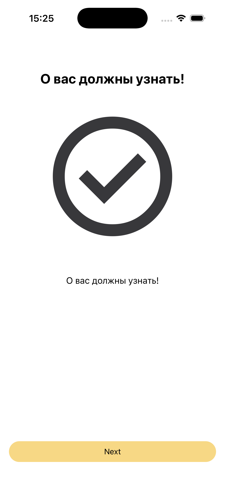
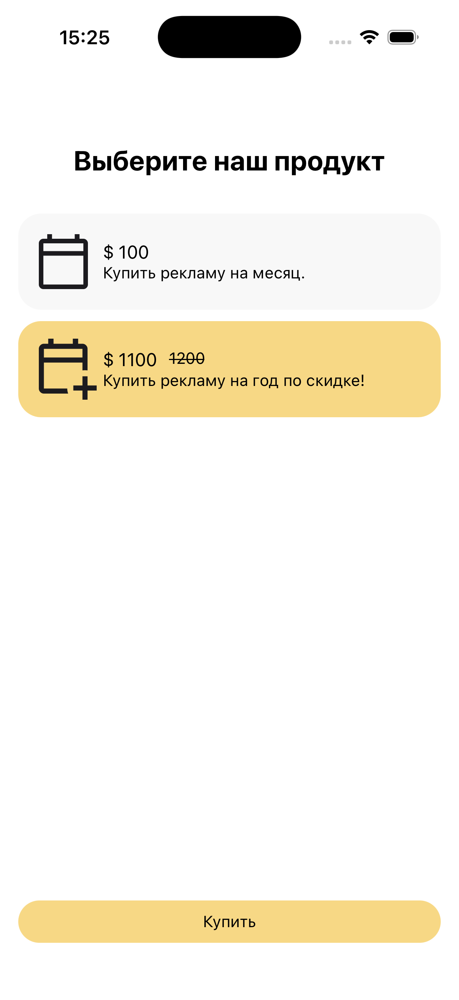

# Тестовое задание: Мобильное приложение

## Задание

Во время записи экрана создать простое приложение на React Native(Expo).

[**Тестовое задание**](https://docs.google.com/document/d/1w6RV53f7Q_OIEunEnHYLIehj4Ds-ihOVEuvS9xwK2M0/edit?tab=t.0).

## Скринщоты экранов готового приложения

<div align="center">
  <table>
    <tr>
      <td align="center">
        <br>
        <em>Онбоардинг</em>
      </td>
      <td align="center">
        <br>
        <em>Экран paywall</em>
      </td>
    </tr>
  </table>
</div>

**Архитектура проекта**:

Проект реализован на React Native (Expo) с использованием TypeScript.
Архитектура построена на Layer-based

**Технологичйский стэк**:

- react-navigation/stack

- Zustand/async-storage

- react-native-svg

Так, как проект маленький и важна только скорость, то использовал максильно простые решения и компоненты.

**Что бы я доработал:**:

- Добавил кнопке еще вариант primary и secondary, а так же состояние загрузки loading.

- По хорошему нужно делать проверку покупки продукта через useEffect на старте приложения, потому, что async storage может не успеть загрузиться

- Добавил бы проверку продукта на гравном экране, что бы не приходило null или undefined

- Цену сделал бы формата 199.99, что бы дробная часть тоже была

- FlatList я использовал для разнообразия, но давнно случаи, когда в списке мало объектов лучше использовать map

- Возможно стоило делать на архитектуре Feature-Sliced Design

# Getting Started

```sh
# Using npm
npm install

```

## Step 2: Build and run test app

```sh
# run simulator ios or run android
npx expo start

```

Задание выпонил Коротков Андрей Алексеевич:

+7 (996) 918-34-35
@Ksarados1
